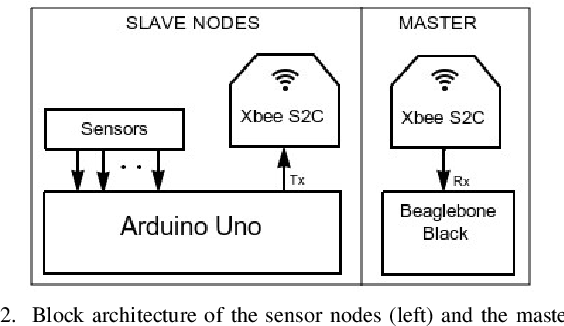
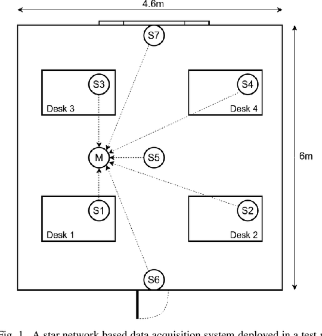

# **Graduate work. Classification task.** *(Based Occupancy Estimation Using Multivariate Sensor Nodes)*

# **Дипломная работа. Задача классификации** *(Оценка занятости помещения на основе многомерных сенсорных узлов)*

## Оглавление

1. [Описание работы](#описание-проекта)

2. [Описание данных](#описание-данных)

3. [Зависимости](#зависимости)

4. [Установка](#установка)

5. [Использование](#использование)

6. [Авторы](#авторы)

7. [Результат](#результат)

## Описание работы

Данная работа - это дипломная работа, финальная зачетная работа курса Data Sciense.

В зданиях большая часть энергии тратится на системы отопления, вентиляции и кондиционирования воздуха. Один из способов оптимизировать их использование — управлять ими в зависимости от в помещениях людей. Данная задача - это задача оценки точного количества людей в комнате с помощью нескольких неинтрузивных датчиков окружающей среды, таких как температура, свет, звук, CO2 и PIR.

Экспериментальный стенд для оценки занятости был развернут в помещении размером 6х4,6 м. В этой установке было 7 сенсорных узлов и один приемник, расположенный в центре звездообразной конфигурации, при этом сенсорные узлы отправляли данные приемнику каждые 30 секунд. Во время сбора набора данных не использовались системы HVAC (отопление, вентиляция и кондиционирование).

В этом эксперименте использовались пять различных типов неинтрузивных датчиков: температуры, света, звука, CO2 и цифрового пассивного инфракрасного излучения (PIR). Сенсорные узлы S1-S4 состояли из датчиков температуры, света и звука, S5 имел датчик CO2, а S6 и S7 имели по одному PIR-датчику, которые были развернуты на выступах потолка под углом, который максимизировал поле зрения датчика для обнаружения движения.

**Цели работы:**

1. Анализ данных, взаимосвязь признаков, их влияние на целевую переменную.
2. Построение моделей МО для предсказания присутствия и количества присутствующих людей в помещении. Выбор модели по точности предсказания (использование всех признаков). Дополнительно постороение baseline модели.
3. Отбор признаков. Методы снижения размерности (проекция и перебор).
4. Проверка моделей МО с использованием уменьшенного количества признаков (полученные варианты наборов признаков из отбора признаков). Дополнительно проверка baseline.
5. Сравнение точности моделей и разных наборов признаков.
6. Продакшен. Загрузка модели в файл, подготовка сервиса Flask.

Обозначение классов: 0, 1, 2 и 3, соответственно количеству людей в помещении.

Уменьшенным количеством признаков считается 5 (по числу групп однотипных признаков: температура, освещенность, звук, СО2 и движение). А минимальное количество определяется с помощью методов снижения размерности.

[Оглавление](#оглавление)

**Структура работы:**

* [data](./data/) - папка с файлом данных Occupancy_Estimation.csv
* [flask](./flask/) - папка с веб-сервером flask
* [images](./images) - папка с изображениями, необходимыми для проекта
* [diplom.ipynb](./diplom.ipynb) - jupyter-ноутбук, содержащий код работы

**Метрика качества:**

В качестве метрик, исходя из того, что рассматриваемая задача - задача классификации, используются стандартные метрики:

- accuracy,
- precision (weighted),
- recall (weighted),
- f1 (weighted),
- f1 для каждого класса отдельно,
- сумма ошибочных значений для всех классов (т.е. сумма всех ошибок модели на конкретном предсказании),
- процентная доля суммы ошибочных значений для всех классов от объема тестовой выборки.

Из значений этих метрик для всех моделей составлена общая таблица.

Кроме того, для каждой модели выводится текстовый отчет результатов классификации classification_report (набор указанных метрик по классам и суммарно - взвешенно).

[Источник данных](https://www.semanticscholar.org/paper/Machine-Learning-Based-Occupancy-Estimation-Using-Singh-Jain/e631ea26f0fd88541f42b4e049d63d6b52d6d3ac)

[Датасет на kaggle.com](https://www.kaggle.com/datasets/ananthr1/room-occupancy-estimation-data-set)

[Оглавление](#оглавление)

## Описание данных

Данные собирались в течение 4 дней контролируемым образом при наполняемости помещения от 0 до 3 человек. Фактические данные о количестве людей в комнате были отмечены вручную.

**Информация о признаках:**

*Категориальные переменные:*

* Дата: ГГГГ/ММ/ДД
* Время: ЧЧ:ММ:СС
* Room_Occupancy_Count: целевая переменная (4 значения - количество людей, от 0 до 3 )

*Числовые переменные:*

* Температура: в градусах Цельсия.
* Свет: в люксах (люкс — это мера того, сколько света падает на определенную поверхность).
* Звук: в вольтах (выход усилителя АЦП).
* CO2: в частях на миллион.
* Разница CO2: разница значений CO2, измеренных в скользящем окне, в частях на миллион.
* PIR: двоичное значение, передающее обнаружение движения (0 - нет, 1 - есть).

## Зависимости

- python 3.10.8
- numpy 1.23.5
- pandas 2.1.0
- scipy 1.11.2
- umap-learn 0.5.4
- factor-analyzer 0.5.0
- mlxtend 0.23.0
- lightgbm 4.1.0
- optuna 3.2.0
- scikit-learn 1.3.0
- matplotlib 3.7.0
- seaborn 0.12.2

[Оглавление](#оглавление)

## Установка

[git](https://github.com/artem-75/Graduate_work)

Нажать зеленую кнопку: <> Code, далее выбрать нужное (клонировать репозиторий, открыть на ПК или скачать его архив), при запуске кода в jupyter-ноутбуке необходимо учесть существующие зависимости.

Все данные необходимо скачать отдельно по указанным ссылкам и установить в подпапки data и images папки проекта на локальном диске.

Веб-сервер flask и клиент необходимо запускать в отдельных терминалах как стандартные приложения python. Порт 5000 на localhost должен быть свободен для работы веб_сервера.

## Использование

Вся информация о работе представлена в jupyter-ноутбуке [diplom.ipynb](diplom.ipynb).

Веб-сервер настроен на прослушивание порта 5000 на локальном компьютере. Клиент в диалоговом режиме позволяет вводить данные для модели МО (строка из 16 чисел с разделителем ",") и получать результат предсказания - количество людей в помещении. Данные необходимо брать в файле Occupancy_Estimation.csv (без даты, времени и указанного количества людей в помещении).

## Авторы

[Артем Корнев](https://t.me/@Artem1975)

## Результат

* Проведено изучение данных и EDA.

* Построены модели логистической регрессии (baseline), классификатора случайного леса и LightGBM с подбором гиперпараметров (GridSearchCV и Optuna).

* Проведено уменьшение размерности методами проекции и отбора признаков.

* Построены модели на новых пространствах признаков.

* Проведен анализ качества предсказаний вариантов моделей и пространств признаков.

* Подготовлен продакшен (веб-сервер flask и клиент).

* Полученный процент ошибок классификации менее 0.3 % для полного набора признаков и 1.5 % при уменьшении размерности до 2 признаков.

[Оглавление](#оглавление)
